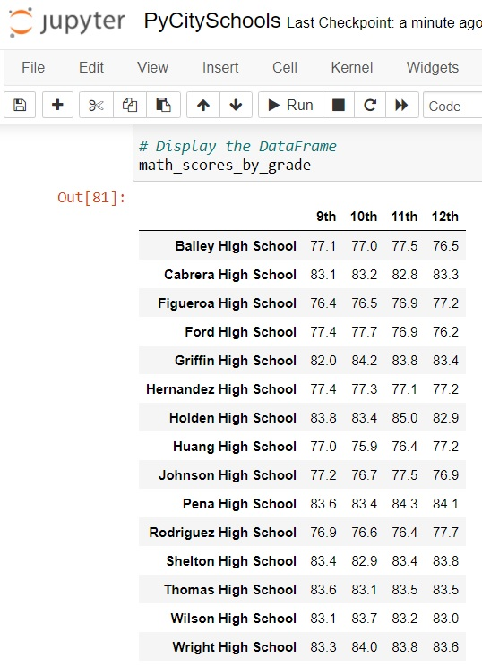
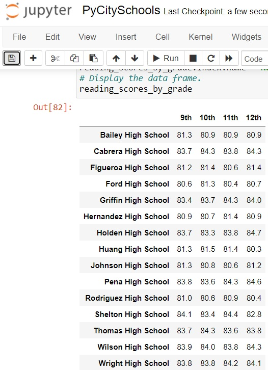

# School_District_Analysis

## Overview of the school district analysis:
The school board suspected there is academic dishonesty in the reading and math grades for Thomas High School ninth graders. You are asked to replace the math and reading scores for Thomas High School ninth graders with NaNs while keeping the rest of data intact. Once you've replaced the data, you would repeat the school district analysis and write up a report to describe how these changes affected the overall analysis.

## Results
- How is the district summary affected?

    District Summary Before Replacement
    

    District Summary After Replacement
    

    - "Average Math Score" was dropped from 79.0 to 78.9 after replacing the data.
    - "% Passing Math" dropped from 75 to 74.8 after replacing the data.
    - "% of Passing Reading" dropped from 86 to 85.7 after replacing the data.
    - "% Overall Passing" dropped from 65 to 64.9 after replacing the data.

- How is the school summary affected?

    School Summary Before Replacement
    

    School Summary After Replacement
    

    - Only the data for Thomas High School (THS) was affected, while results for other schools are remain unchanged.
    - "Average Math Score" for THS was dropped from 83.418349 to 83.350937 after replacing the data.
    - "Average Reading Score" for THS was increased from 83.848930 to 83.896082 after replacing the data.
    - "% Passing Math" for THS dropped from 93.272171 to 93.185690 after replacing the data.
    - "% of Passing Reading" for THS dropped from 97.308869 to 97.018739 after replacing the data.
    - "% Overall Passing" for THS dropped from 90.948012 to 90.630324 after replacing the data.

- How does replacing the ninth graders’ math and reading scores affect Thomas High School’s performance relative to the other schools?

    High and Low Performing Schools Before Replacement
    

    High and Low Performing Schools After Replacement
    

    - There is no change on the position of the top and bottom 5 schools based on the "% Overall Passing".
    - **Thomas High School** positioned at second place of the top performing school.

- How does replacing the ninth-grade scores affect the following:
    - Math and reading scores by grade
    
        Math Scores by Grade Before Replacement
        

        Reading Scores by Grade Before Replacement
        

        Math Scores by Grade After Replacement
        

        Reading Scores by Grade After Replacement
        
        
        - Before data replacement, Math scores for Thomas High School by grade are: 9th: 83.6, 10th: 83.1, 11th: 83.5, 12th: 83.5
        - Before data replacement, reading scores for Thomas High School by grade are: 9th: 83.7, 10th: 84.3, 11th: 83.6, 12th: 83.8 <-- 
        - After data replacement, Math scores for Thomas High School by grade are: 9th: nan, 10th: 83.1, 11th: 83.5, 12th: 83.5
        - After data replacement, reading scores for Thomas High School by grade are: 9th: nan, 10th: 84.3, 11th: 83.6, 12th: 83.8

    - Scores by school spending
    - Scores by school size
    - Scores by school type

## Summary
Summarize four changes in the updated school district analysis after reading and math scores for the ninth grade at Thomas High School have been replaced with NaNs.
